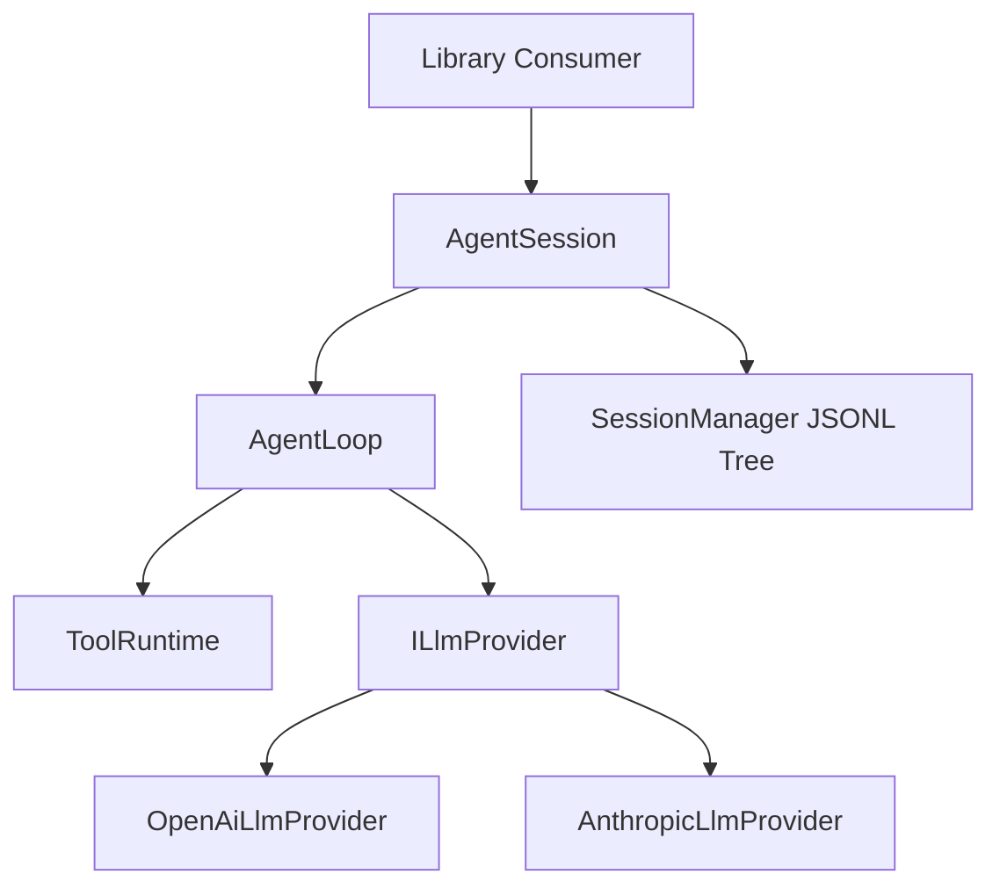

# Architecture Overview

SharpAgent is split into two runtime libraries plus tests.

## Components

### 1. `Sharp.AI`

Responsibilities:

- Unified model/message abstractions.
- Structured content blocks (`text`, `image`, `thinking`, `tool_call`, `tool_result`).
- Streaming event model for provider adapters.
- Provider adapters:
  - OpenAI Chat Completions (`OpenAiLlmProvider`)
  - Anthropic Messages (`AnthropicLlmProvider`)

Core interfaces:

- `ILlmProvider`
- `LlmRequest`
- `LlmStreamEvent`
- `ToolDefinition`
- `LlmMessage`

### 2. `Sharp.Core`

Responsibilities:

- Session-driven orchestration (`AgentSession`).
- Multi-turn agent loop with tool execution (`AgentLoop`).
- Session control operations (`ContinueAsync`, steering/follow-up queue, abort/wait idle).
- Tool runtime dispatch (`ToolRuntime`).
- Tree-based JSONL persistence (`SessionManager`).
- Built-in coding tools: `read`, `write`, `edit`, `bash`, `grep`, `find`, `ls`.
- Configuration utilities (`AgentConfigurationService`).

Core interfaces/classes:

- `IAgentTool`
- `ToolInvocationResult`
- `AgentEvent`
- `SessionManager`

### 3. `Sharp.Core.Tests`

Responsibilities:

- Unit tests for tool/runtime/config/session behavior.
- Provider mapping and streaming assembly tests.
- End-to-end library integration tests (`session + loop + tool call`).

## High-Level Flow

## Session Storage

- One `.jsonl` file per session.
- First line: `session` header.
- Subsequent lines: entries with `id`, `parentId`, `type`, `payload`.
- Context rebuild supports `message`, `custom_message`, `branch_summary`, and `compaction`.

## Non-Goals in This Phase

- No interactive shell, no web API, no desktop UI.
- No extension/plugin runtime.
- No UI-level compaction workflow yet (entries and context rebuild hooks exist in core storage).
