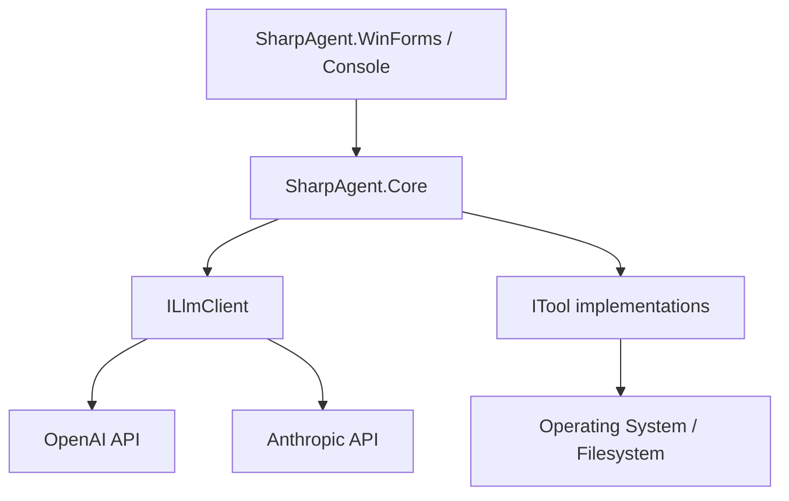

# Architecture Overview

SharpAgent is structured as a collection of .NET projects, each with a specific responsibility.

## Component Breakdown

### SharpAgent.Core
The heart of the system. It contains:
- **`Agent`**: The main execution loop controller.
- **`ILlmClient`**: An abstraction for LLM providers. Currently supports:
    - `OpenAiClient`: Integration with OpenAI API (GPT-4o, etc.).
    - `AnthropicClient`: Integration with Anthropic API (Claude 3.5 Sonnet, etc.), supporting native "thinking" blocks.
- **`ITool`**: The interface for all agent capabilities.
- **Configuration**: Strongly typed configuration models (`AgentConfig`) and service.

### SharpAgent.Console
A command-line interface for interacting with the agent. It demonstrate how to consume the `Core` library in a terminal environment, supporting ANSI colors and interactive prompts.

### SharpAgent.WinForms
A modern Windows Forms application providing a rich chat interface. Features include:
- Streaming message bubbles.
- Collapsible tool call cards.
- Dark mode/Modern aesthetics.
- Real-time "thinking" visualization.

### SharpAgent.Api
A web API layer (likely used by the web frontend) that wraps the agent logic into HTTP endpoints.

## Relationship Diagram

